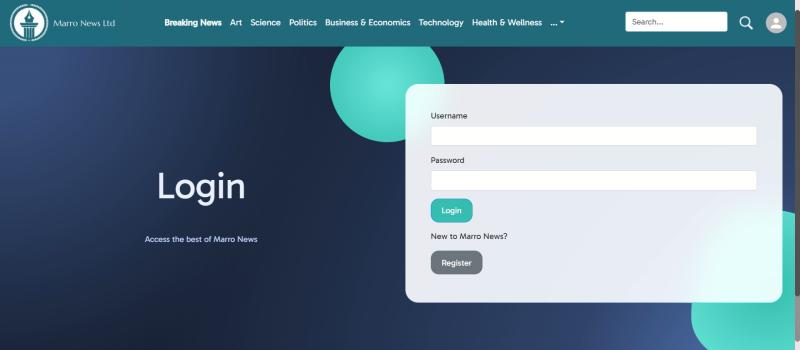
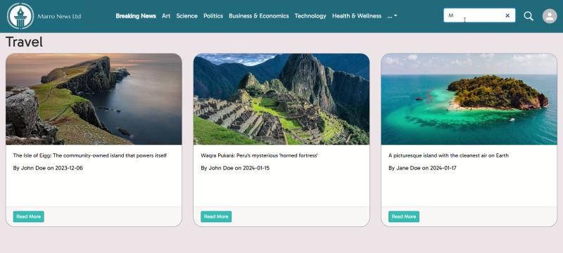
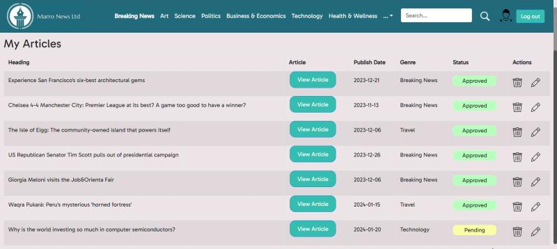
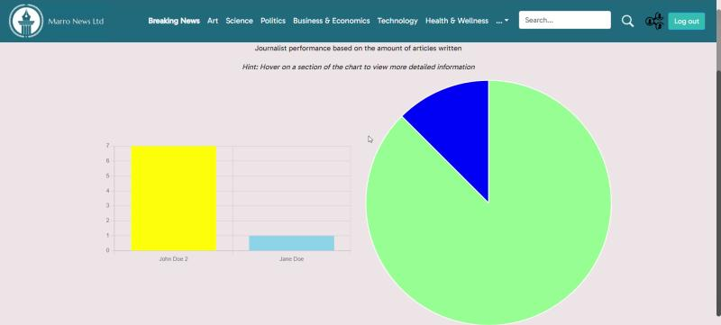

# Marro News - Frontend React.js Web Application

**Fontys University of Applied Sciences - Semester 3**
**Individual Project**

Marro News is a news web application built as an individual project for Semester 3 at Fontys University of Applied Sciences. The frontend provides a responsive, user-friendly interface for reading, managing, and interacting with news articles. It communicates with a Spring Boot REST API backend and supports role-based views for readers, journalists, and admins.

---

## Tech Stack


---

## Features

- Browse and read news articles filtered by genre
- Journalist portal to write and submit articles for approval
- Admin dashboard to approve or reject submitted articles
- User favourites list
- Article and journalist statistics with charts
- Real-time updates via WebSocket (STOMP)
- JWT-based authentication with role-based routing
- Fully responsive layout with Bootstrap & Material UI

---

## Screenshots

### User Flow

#### Homepage


#### Login Page


#### Articles Page


---

### Journalist & Admin Flow

#### Manage Articles (Journalist View)


#### Journalist Statistics (Admin View)


---

## Getting Started

### Prerequisites

- Node.js (v18+)
- The [Marro News Backend](../README.md) running locally

### Install & run

```bash
cd News_Web_App_Frontend
npm install
npm run dev
```

The app will be available at `http://localhost:5173`.

### Build for production

```bash
npm run build
```

---

## Project Structure

```
src/
├── api/                        # Axios API calls per domain
│   ├── AuthAPI.jsx             # Login & token handling
│   ├── ArticleAPI.jsx          # Article CRUD
│   ├── ApprovalAPI.jsx         # Article approval flow
│   ├── AdminAPI.jsx            # Admin operations
│   ├── JournalistAPI.jsx       # Journalist management
│   ├── UserAPI.jsx             # User account operations
│   ├── FavouritesListAPI.jsx   # Favourites management
│   ├── SearchArticlesAPI.jsx   # Article search
│   ├── SearchJournalistAPI.jsx # Journalist search
│   ├── NotificationAPI.jsx     # Notifications
│   ├── ReadingTimeAPI.jsx      # Reading time tracking
│   ├── ArticleStatisticsAPI.jsx
│   ├── FavoruitesListStatistics.jsx
│   └── TokenManager.jsx        # JWT token utilities
├── components/
│   ├── article/                # Article cards, forms, approval, favourites
│   ├── journalist/             # Journalist table, forms, popups
│   ├── navigation/             # Role-based nav (user, journalist, admin)
│   ├── profile/                # Profile view, update, delete
│   ├── statistics/             # Bar, pie & donut charts
│   ├── login-register/         # Login & register forms
│   ├── form/                   # Reusable form controls & buttons
│   ├── search/                 # Search bar
│   ├── loader/                 # Loading spinners
│   ├── alert/                  # Alert messages
│   ├── access/                 # Access denied screen
│   └── utilities/              # Enum converters
├── notification/
│   ├── NotificationContainer.jsx
│   └── WebSocketNotifications.jsx  # Real-time STOMP/WebSocket
├── pages/
│   ├── HomePage.jsx
│   ├── AllArticlesPage.jsx
│   ├── ArticlesByGenrePage.jsx
│   ├── IndividualArticlePage.jsx
│   ├── ArticleApprovalPage.jsx
│   ├── JournalistArticlesPage.jsx
│   ├── JournalistInformationPage.jsx
│   ├── JournalistsPage.jsx
│   ├── FavouritesListPage.jsx
│   ├── FavouritesListStatistics.jsx
│   ├── PerformanceStatistics.jsx
│   ├── AccountPage.jsx
│   ├── LoginPage.jsx
│   ├── RegisterPage.jsx
│   └── SearchResults.jsx
├── styles/                     # Component-scoped CSS files
├── validation/                 # Form validation logic per role
├── assets/                     # Images & static files
├── App.jsx                     # Routes & layout
└── main.jsx                    # Entry point
```

---

## Academic Context

| | |
|---|---|
| Institution | Fontys University of Applied Sciences |
| Semester | Semester 3 |
| Project type | Individual |
| Focus | Full-stack web development, REST APIs, security, CI/CD |

---

## License

This project was created solely for educational purposes as part of an academic programme at Fontys University of Applied Sciences.

You are welcome to read and reference the code for learning or academic purposes. However, copying, modifying, redistributing, or using any part of this project, in whole or in part ,without the explicit written consent of the author is not permitted.

© 2024 - All rights reserved.